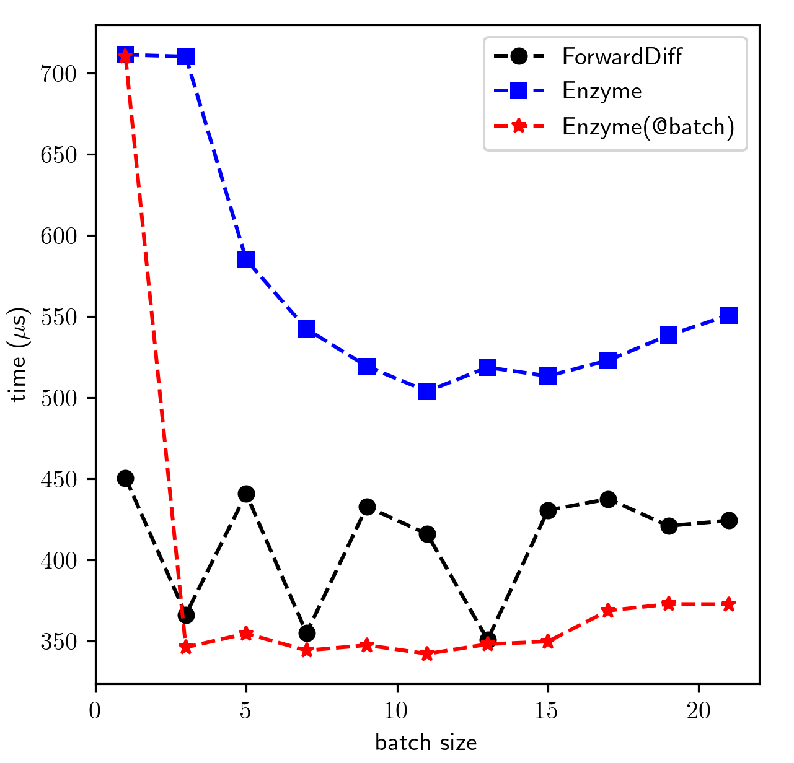

# TrixiEnzyme

## Getting started

[Wikipedia's automatic differentiation entry](https://en.wikipedia.org/wiki/Automatic_differentiation) is a useful resource for learning about the advantages of AD techniques over other common differentiation methods (such as finite differencing).

TrixiEnzyme is not a registered Julia package, and it can be installed by running:
```
] add https://github.com/junyixu/TrixiEnzyme.jl.git
```

## Notes about Enzyme

There's some [issues](https://github.com/EnzymeAD/Enzyme.jl/issues/1661) with `Enzyme.make_zero!` right now for this use case.
One needs to be careful with a vanilla closure outside Enzyme.
If one writes to caches and expect to differentiate through them, then the closure should be duplicated for handling the derivative of those values.
If you want to track derivatives through arrays that are enclosed, you have to duplicate the array to have shadow memory for its differentiation.
if you want to track derivatives through arrays that are enclosed, you have to duplicate the array to have shadow memory for its differentiation
So if you only have the original memory, you cannot do the differentiation since you don't have a place to store the extra values. In a simplified sense, a `Dual{Float64}` is 128 bits, `Float64` is 64 bits, so if you're writing to a buffer of 5 `Float64` numbers, you need 5*2*64 bits of space to keep a dual number, which you don't have
So the best thing to do for a user would be to separate out the things that you need to track through, make them arguments to the function, and then simply Duplicate on those.
This is how [`TrixiEnzyme.jacobian_enzyme_forward`](https://junyixu.github.io/TrixiEnzyme.jl/dev/api.html#TrixiEnzyme.jacobian_enzyme_forward) works.

## Configuring Batch Size

To utilize `Enzyme.BatchDuplicated`, one can create a tuple containing duals (or shadows).
TrixiEnzyme.jl performs partial derivative evaluation on one "batch" of the input vector at a time.
Each differentiation of a batch requires a call to the target function as well as additional memory proportional to the square of the batch's size.
Thus, a smaller batch size makes better use of memory bandwidth at the cost of more calls to the target function,
while a larger batch size reduces calls to the target function at the cost of more memory bandwidth.

```julia-repl
julia> x = -1:0.5:1;
julia> batch_size = 2
julia> @time jacobian_enzyme_forward(TrixiEnzyme.upwind!, x, N=batch_size)
  0.000040 seconds (31 allocations: 1.547 KiB)
5×5 Matrix{Float64}:
 -0.2  -0.0  -0.0  -0.0   0.2
  0.2  -0.2  -0.0  -0.0  -0.0
 -0.0   0.2  -0.2  -0.0  -0.0
 -0.0  -0.0   0.2  -0.2  -0.0
 -0.0  -0.0  -0.0   0.2  -0.2

julia> x = -1:0.01:1;
julia> @time jacobian_enzyme_forward(TrixiEnzyme.upwind!, x, N=2);
  0.000539 seconds (1.34 k allocations: 390.969 KiB)
julia> @time jacobian_enzyme_forward(TrixiEnzyme.upwind!, x, N=11);
  0.000332 seconds (307 allocations: 410.453 KiB)
```

If you do not explicitly provide a chunk size, TrixiEnzyme will try to guess one for you based on your input vector:

```julia-repl
julia> x = -1:0.01:1;
julia> @time jacobian_enzyme_forward(TrixiEnzyme.upwind!, x);
  0.000327 seconds (307 allocations: 410.453 KiB)
```

Benchmark for a 401x401 Jacobian of `TrixiEnzyme.upwind!` (Lower is better):

`Enyme(@batch)` means applying `Polyester.@batch` to `middlebatches`.
