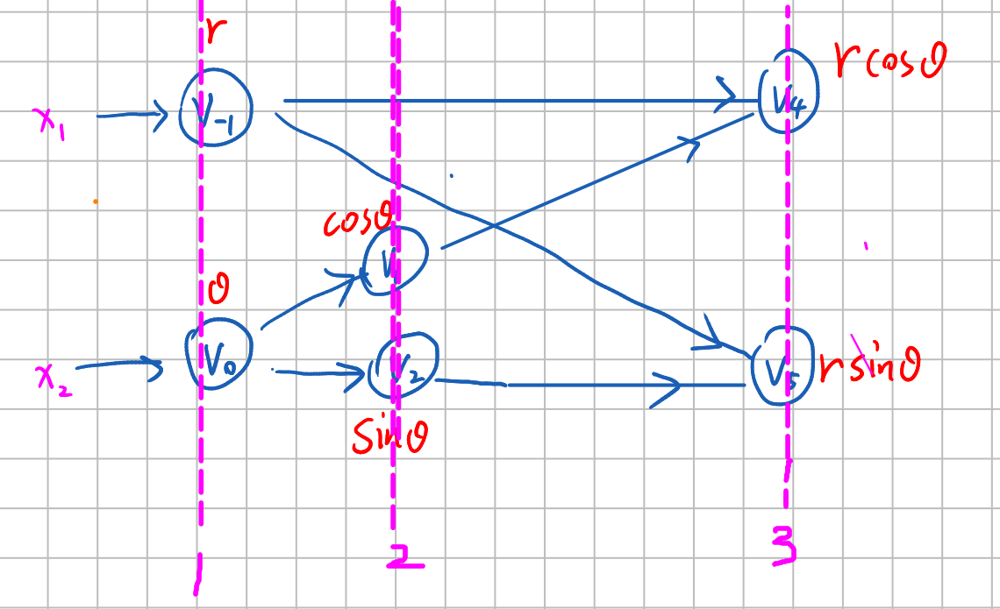

## Proof of reverse mode AD

Take the example of polar coordinate system $x = r \cos \theta, y = r \sin \theta$,
according to the chain rule:

We use $t$ to represent the $n$-th layer in the tree.
with the values of 1,2,3.

$$\frac{\partial y_1}{\partial x_1} = \frac{\partial y_1}{\partial v_4} \frac{\partial v_4}{\partial x_1} \implies \frac{\partial y_1}{\partial x_1} = \sum_{i(t)} \frac{\partial y_1}{\partial v_{t,i}} {\color{red}\frac{\partial v_{t,i}}{\partial x_1}}$$

$$\frac{\partial v_4}{\partial x_1} = \frac{\partial v_4}{\partial v_{-1}} \frac{\partial v_{-1}}{\partial x_1} + \frac{\partial v_4}{\partial v_1} \frac{\partial v_1}{\partial x_1} \implies {\color{red}\frac{\partial v_{t,i}}{\partial x_1}} = \sum_{j(t)} \frac{\partial v_{t,i}}{\partial v_{t-1, j}} \frac{\partial v_{t-1, j}}{\partial x_1}$$

$$\frac{\partial y_1}{\partial x_1} = \sum_{i(t)} \frac{\partial y_1}{\partial v_{t,i}}
\sum_{j(i)} \frac{\partial v_{t,i}}{\partial v_{t-1,j}} \frac{\partial v_{t-1,j}}{\partial x_1} = \sum_{j} \bar{v}_{t-1,j} \frac{\partial v_{t-1,j}}{\partial x_1}$$
where we define adjoint as
$$\bar{v}_{t-1, j} = \sum_i \bar{v}_{t, i} \frac{\partial v_{t,i}}{\partial v_{t-1,j}}.$$
For example (in this computing graph):
$$\bar{v}_0 = \bar{v}_{1,2} = \frac{\partial v_{2,1}}{\partial v_{1,2}} \bar{v}_{2,1}
+ \frac{\partial v_{2,2}}{\partial v_{1,2}} \bar{v}_{2,2}.$$
